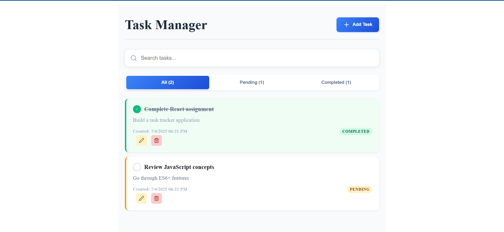
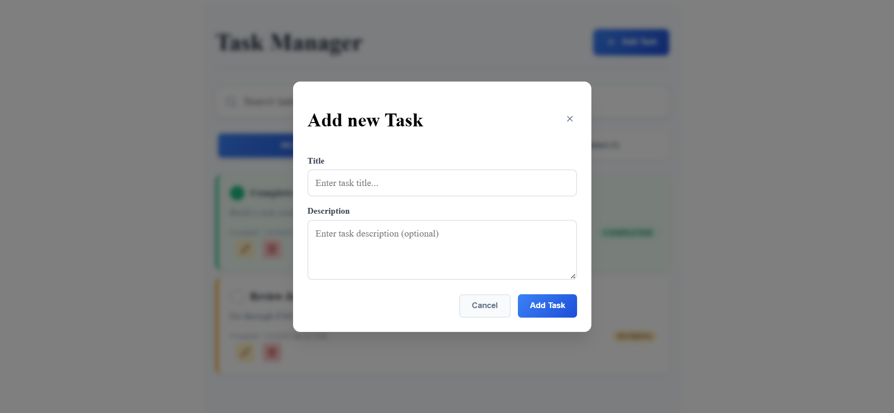

# Personal Task Tracker

## 📖 Description

A simple and intuitive web application to help you organize, track, and manage your daily tasks efficiently. Stay productive by keeping all your to-dos in one place.

## 🚀 Features

- Add, edit, and delete tasks
- Mark tasks as completed or pending
- Search tasks by keyword
- Responsive and user-friendly interface
- Persistent storage with local storage

## 🛠 Setup Instructions

1. Clone the repository
2. Run `npm install`
3. Run `npm run dev`
4. Open [http://localhost:5173](http://localhost:5173)

## 🧰 Technologies Used

- React.js
- React Hooks
- CSS Modules

## 🔗 Live Demo

[Live Demo](https://personal-task-tracker-roan.vercel.app/)

## 🧹 Code Quality

- Clean, readable, and well-documented codebase
- Good segregation of components and logic for maintainability

## 🖼 Screenshots

